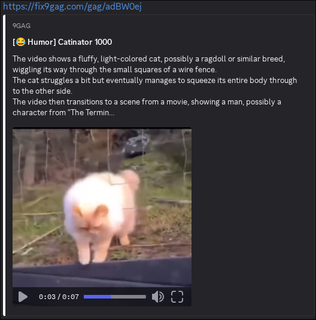
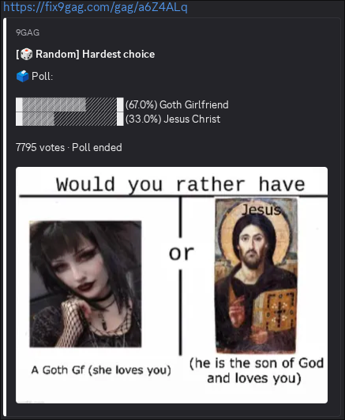

# fix9gag

A lightweight service to generate proper embed for 9GAG posts and designed to make Discord (and potentially other apps) display 9GAG links with full, rich previews.

## How to Use

Easily generate rich embeds for 9GAG links by swapping the domain in your URL.
It works instantly, no registration or setup required.

**How it works:**
1. **Take any 9GAG link:**  
   `https://9gag.com/gag/ae9qb4B`

2. **Replace** `9gag.com` **with** `fix9gag.com`:  
   `https://fix9gag.com/gag/ae9qb4B`

3. **Share your new link:**  
   Send the modified link in your app to get a full media preview.

- **Free public instance:** Open to everyone at [https://fix9gag.com](https://fix9gag.com), no signup needed.
- **Privacy-first:** No user information is logged. Only minimal, anonymous technical logs are kept for debugging.

## Screenshot on Discord

### Video support:  


### Poll support:  


## Quick Start

### Run Natively (Axum HTTP Server)

```sh
git clone https://github.com/yourname/fix9gag.git
cd fix9gag
cargo run
```

- The server listens by default on `127.0.0.1:8000`.
- To customize settings, see the [Configuration](#configuration) section.

### Deploy as a Cloudflare Worker

**Requirements:**
- [Cloudflare account](https://dash.cloudflare.com/)
- [Wrangler CLI](https://developers.cloudflare.com/workers/wrangler/install-and-update/)
- Cloudflare environment variables configured

**Steps:**

1. Create a `wrangler.toml` configuration file in your project root.
    - You can copy and edit `wrangler.example.toml`:
    ```sh
    cp wrangler.example.toml wrangler.toml
    ```
2. Deploy:
    ```sh
    wrangler deploy
    ```

### Run in Docker

**Requirements:**
- [Docker](https://docs.docker.com/get-docker/) installed

```sh
docker buildx build -t fix9gag:latest .
docker run -p 8000:8000 fix9gag:latest
```

- The default port is `8000`.  
  Visit [http://localhost:8000](http://localhost:8000) to access the server.
- The provided `Dockerfile` makes containerization easy.

## Configuration

fix9gag can be configured via file or environment variables.

Priorities:
1. **Environment variables** (see below)
2. **fix9gag.toml** in working directory (you can use `fix9gag.example.toml` as a reference)
3. **Defaults** (hardcoded)

| Option           | TOML Key          | Environment Variable             | Example value                |
|------------------|-------------------|----------------------------------|------------------------------|
| Host             | `host`            | `FIX9GAG_HOST`                   | `127.0.0.1`                  |
| Port             | `port`            | `FIX9GAG_PORT`                   | `8000`                       |
| Public Hostname  | `hostname`        | `FIX9GAG_HOSTNAME`               | `https://my.domain.com`      |
| oEmbed Endpoint  | `oembed_endpoint` | `FIX9GAG_OEMBED_ENDPOINT`        | `oembed`                     |
| Provider Name    | `provider_name`   | `FIX9GAG_PROVIDER_NAME`          | `9GAG`                       |
| Provider URL     | `provider_url`    | `FIX9GAG_PROVIDER_URL`           | `https://9gag.com`           |
| Embed Color      | `embed_color`     | `FIX9GAG_EMBED_COLOR`            | `#FFFFFF`                    |

**Cloudflare Workers:**  
Use uppercase (no prefix): e.g. `HOST`, `PORT`, ...  
Also requires: `KV_STORE_NAME` for KV cache.

## License

fix9gag is licensed under the [Unlicense](https://unlicense.org/).

## Contributing

*Have suggestions or want to contribute? Open an issue or PR!*
